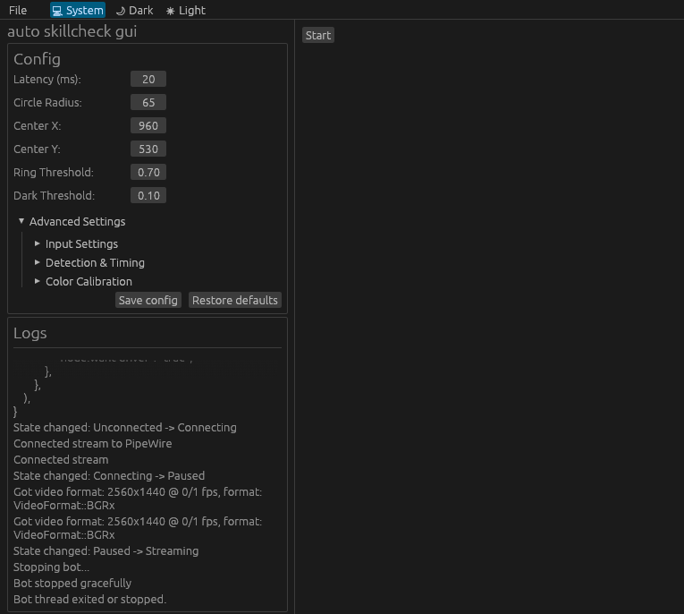

# DBD Auto-SkillCheck



A simple and highly optimized auto-skillcheck bot for Dead by Daylight.

*   [Linux Build & Setup](#linux-build--setup)
*   [Windows Build & Setup (Experimental)](#windows-build--setup-experimental)

---

## Linux Build & Setup

> ⚠️ **Important Warning**: The Linux build relies on PipeWire DMA-BUF frame negotiation, which is highly compositor-dependent. It has only been tested on **Niri** and **KDE Plasma 6**. On other compositors, it may fallback to SHM (Shared Memory) streams and fail to run, or require additional configuration. 

Unlike traditional screenshot-based bots, this project imports PipeWire DMA-BUF frames directly into Vulkan, avoiding full-frame CPU copies. It performs GPU-side cropping and frame extraction, resulting in minimal CPU overhead and low latency.

### Requirements (Linux)
* **Rust toolchain** (cargo, rustc 1.75+ or newer)
* Wayland compositor supporting DMA-BUF screencast sharing (by default).
* PipeWire (including headers/development libraries)
* **Clang** (required by `bindgen` to generate Rust bindings for PipeWire/SPA headers during build)
* **pkg-config** (required to locate PipeWire libraries)
* Vulkan 1.2+
* Linux with `/dev/uinput` support

### Setup uinput Permissions

To run the bot without root permissions, your user needs write access to `/dev/uinput`.

First, check if your system already has a udev rule for uinput:
```bash
ls /lib/udev/rules.d/*uinput*
```
If you see a result (e.g. `80-uinput.rules` or `60-steam-input.rules`), the rule already exists — skip to step 2.

If not, create one at `/etc/udev/rules.d/99-uinput.rules`:
```bash
echo 'KERNEL=="uinput", GROUP="input", MODE="0660"' | sudo tee /etc/udev/rules.d/99-uinput.rules
```

Then:

1. Add your user to the `input` group:
   ```bash
   sudo usermod -aG input $USER
   ```
2. Reload udev rules and trigger uinput:
   ```bash
   sudo udevadm control --reload-rules && sudo udevadm trigger --action=add /dev/uinput
   ```
3. Log out and back in (or reboot) for group changes to take effect.

### Building & Running (Linux)

1. Build the project in release mode:
   ```bash
   cargo build --release
   ```

2. Run the bot (GUI mode recommended):
   ```bash
   ./target/release/gui
   ```
   Or run the headless version:
   ```bash
   ./target/release/cli
   ```

Optionally, you can copy the compiled binaries to your local path for global execution:
```bash
cp target/release/gui ~/.local/bin/dbd-skillcheck-gui
cp target/release/cli ~/.local/bin/dbd-skillcheck-cli
```

---

## Windows Build & Setup (Experimental)

> ⚠️ **Windows Build Status**: The Windows build is poorly tested, so **it is not guaranteed to work on all** Windows configurations.
### Building on Windows

To compile the executable natively on Windows:

1. Install the [Rust toolchain](https://rustup.rs/).
2. Open PowerShell or Command Prompt in the project folder and run:
   ```cmd
   cargo build --release --bin gui
   ```

The compiled file `gui.exe` will be located at:
`target\release\gui.exe`.

---

## Configuration

A default configuration file is automatically created at:
*   **Linux**: `~/.config/dbd-auto-skillcheck-linux/config.toml`
*   **Windows**: `%APPDATA%\dbd-auto-skillcheck\config.toml`

* `circle_center_x` / `circle_center_y` — coordinates of the skillcheck widget (default is set for 1920x1080).
* `latency_ms` — input lag compensation (default 18.0 ms). **To click earlier, increase this value; to click later, decrease it**.

### Tuning Parameters
To adapt the bot to your resolution or reshade:
1. Take a screenshot during a skillcheck.
2. Load the screenshot into **GIMP** (or any image editor).
3. Use the **Color Picker** tool to find the pixel coordinates of the skillcheck circle's center, then update `circle_center_x` and `circle_center_y` in the configuration.

> **Note**: This bot processes colors in **HSV** (Hue, Saturation, Value) space instead of RGB. HSV color spaces are much more robust and work significantly better with **Reshade** shaders or custom in-game overlays.

> ❄️ **Bright / Snow Maps (e.g., Ormond)**: Since the widget detection is based on circular HSV color thresholding (looking for a dark inner circle and the white zone), very bright/white backgrounds (like looking directly at snow, bright lights, or fog) might wash out or overlap with the widget's HSV thresholds. In such cases, the skillcheck might not be detected. To resolve this, you can adjust the `grey_v_min`/`grey_v_max` and `white_val_min` HSV thresholds in the configuration.

## TODO

- [x] ~~**Wiggle Mode** — auto-click during wiggle skillchecks.~~
- [ ] **Perk Support** — handle Bardic Inspiration / Onryo
- [ ] **Auto Focus** — when the bot detects a skillcheck, move the mouse cursor / focus to the game window
